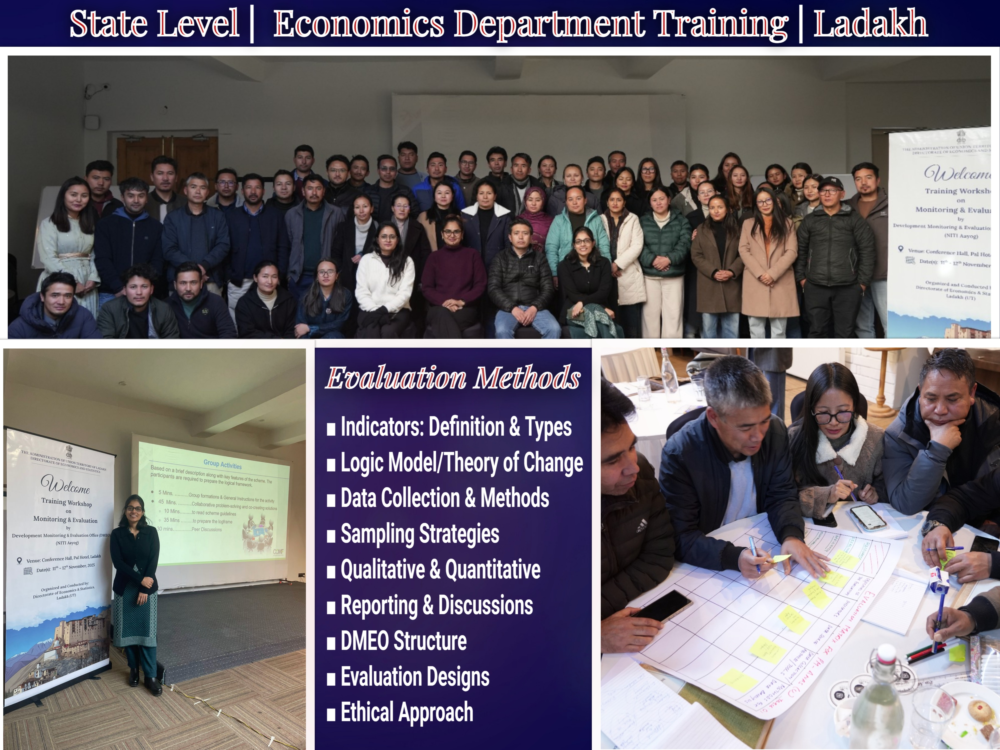

### Overview

Co-led a two-day workshop in Ladakh for state officials to help the state set its own Monitoring and Evaluation (M&E) frameworks.The sessions focused on institutionalizing the core structures such as the Data Governance Quality Index (DGQI) and the Output-Outcome Monitoring Framework (OOMF). Listed below are the frameworks and themes we explored during the workshop.

### Frameworks

```{=html}
<!DOCTYPE html>
<html>
  
  </head>
  <body>
    
    <object data="outcomebudget.pdf" type="application/pdf" width="100%" height="500px">
      <p>Unable to display PDF file. <a href="outcomebudget.pdf">Download</a> instead.</p>
    </object>
  </body>
</html>
```

### Media


